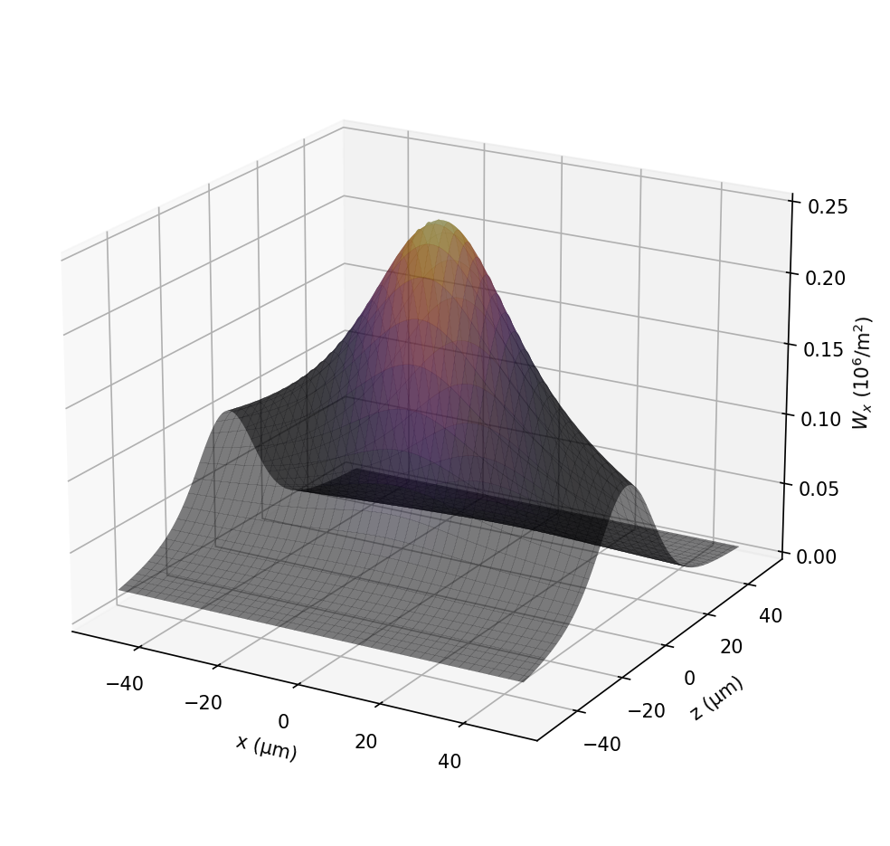

# PyCSR3D
<a href="https://zenodo.org/doi/10.5281/zenodo.5165403"></a>

3D Coherent Synchrotron Radiation computation based on the formalism developed in:

"Three-dimensional effects of coherent synchrotron radiation by electrons in a bunch compressor" 

Yunhai Cai and Yuantao Ding
Phys. Rev. Accel. Beams 23, 014402 – Published 9 January 2020
https://journals.aps.org/prab/abstract/10.1103/PhysRevAccelBeams.23.014402


Also see:
www.github.com/weiyuanlou/PyCSR2D





# Conda environment

```bash
conda env create -f environment.yml
conda activate csr3d
```

# Citing PyCSR3D

If you use `PyCSR3D` for your research, please consider adding the following citation to your publications.

```bibtex
@software{christopher_mayes_2021_5496096,
  author       = {Christopher Mayes},
  title        = {ChristopherMayes/PyCSR3D: PyCSR3D Version 0.2.0},
  month        = sep,
  year         = 2021,
  publisher    = {Zenodo},
  version      = {v0.2.0},
  doi          = {10.5281/zenodo.5496096},
  url          = {https://doi.org/10.5281/zenodo.5496096}
}
```
